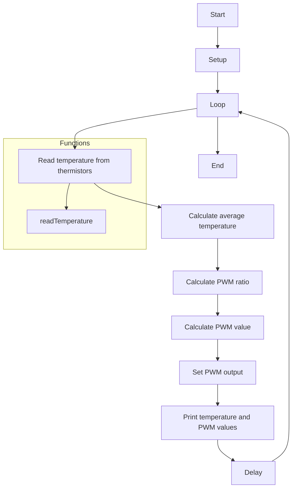

# Temperature Control System

This code is an Arduino sketch for a temperature control system using a thermistor. It reads the temperature from two thermistors, calculates the average temperature, and adjusts a PWM (Pulse Width Modulation) output based on the desired temperature.

## Requirements

To run this code, you will need:

- Arduino board
- Two thermistors
- Resistors
- Jumper wires
- A PWM output device (e.g., fan, heater, LED)

## Circuit Connections

The thermistors should be connected to analog input pins `A0` and `A1` on the Arduino board. The PWM output pin should be connected to pin `9`. Additionally, ensure that the required resistors are correctly connected.

## Constants

The following constants are used for temperature calculation:

- `thermistorNominal`: Nominal resistance of the thermistor at 25°C.
- `temperatureNominal`: Nominal temperature for the thermistor.
- `betaValue`: Beta value of the thermistor.
- `desiredTemperature`: The desired temperature in Celsius.

## Functions

The code contains the following functions:

- `setup()`: Initializes the PWM pin and the Serial Monitor for debugging.
- `loop()`: Continuously reads the temperature from both thermistors, calculates the average temperature, calculates the PWM ratio, sets the PWM output, and prints the temperature and PWM values to the Serial Monitor. It then waits for one second before taking the next reading.
- `readTemperature(int pin)`: Reads the analog value from the specified thermistor pin, converts it to resistance, and calculates the temperature in Celsius using the Steinhart-Hart equation.

## Flowchart 

## Running the Code

1. Connect the thermistors, resistors, and PWM output device according to the circuit connections mentioned above.
2. Upload the code to your Arduino board.
3. Open the Serial Monitor in the Arduino IDE (set the baud rate to `9600`) to view the temperature and PWM values.

## Notes

- The code uses the Steinhart-Hart equation to calculate the temperature from the thermistor resistance. Make sure the equation is appropriate for your specific thermistor.
- Adjust the `thermistorNominal`, `temperatureNominal`, and `betaValue` constants according to the specifications of your thermistor.
- Modify the `desiredTemperature` to set your desired temperature.
- The PWM output pin should be connected to a compatible device capable of adjusting its output based on the PWM value (e.g., a fan, heater, or LED).

## Troubleshooting

- If you encounter any issues, ensure that the circuit connections are correct and the components are properly functioning.
- Double-check the thermistor specifications and adjust the constants accordingly.

## Contributing

Contributions to this repository are welcome. If you encounter any issues or have suggestions for improvements, please open an issue or submit a pull request.

## Acknowledgments

This code was developed based on the requirements of the temperature control system using thermistors.

## Disclaimer

Please note that this code is provided as-is and without any warranty. Use it at your own risk.
